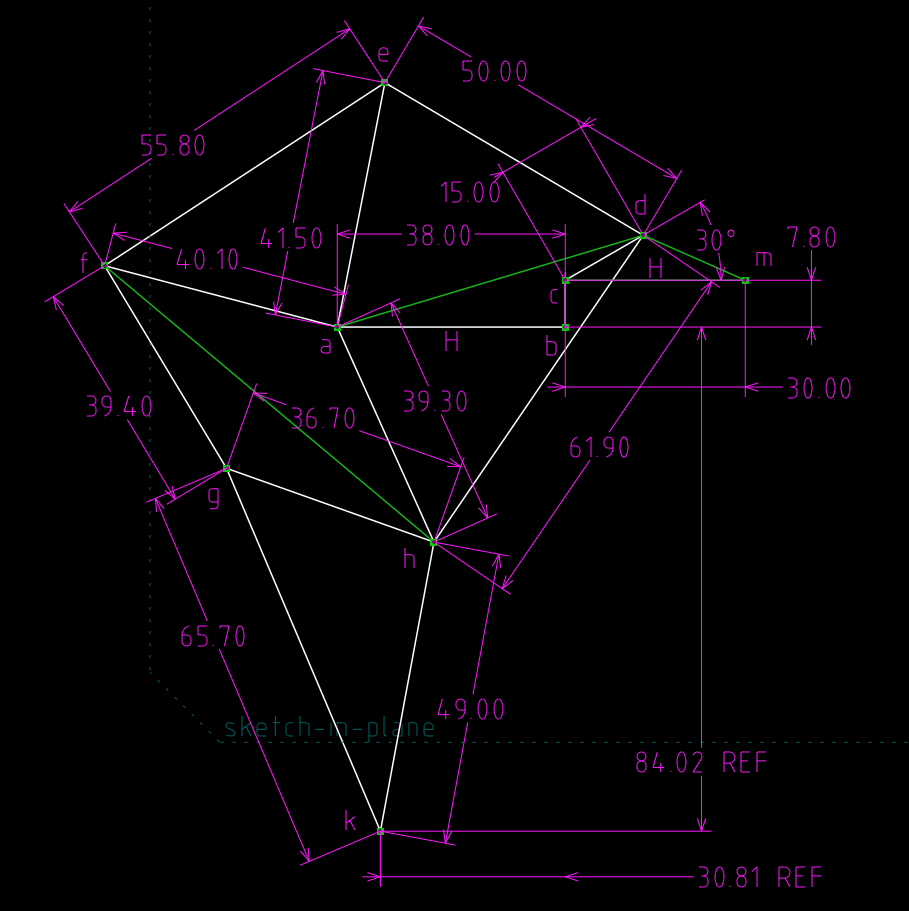

以下程式架構取自 <http://lab.kmol.info/blog/brython-programming-environment.html>, 使用 static/py/ 目錄中的 ace.py 程式定義.

<!-- PELICAN_END_SUMMARY -->

<!-- 導入 FileSaver 與 filereader -->

<!-- 導入平面機構模擬所需程式庫 -->

<!-- sylvester.js 為向量、矩陣與幾何程式庫 http://sylvester.jcoglan.com/ -->

<!-- PrairieDraw.js 為延伸 sylvester.js 的 html5 canvas 繪圖應用程式庫 https://github.com/martin70/PrairieDraw.js -->

<!-- 以下執行 Brython 程式 -->

<!-- 請注意, 這裡使用 Javascript 將 localStorage["py_src"] 中存在近端瀏覽器的程式碼, 由使用者決定存檔名稱-->

編寫 Python3 程式邏輯之前必須先了解基本的程式語法, 其中包括:

Python3 變數命名規則與關鍵字
---

Python 英文變數命名規格

    變數必須以英文字母大寫或小寫或底線開頭
    變數其餘字元可以是英文大小寫字母, 數字或底線
    變數區分英文大小寫
    變數不限字元長度
    不可使用關鍵字當作變數名稱

使用者可以利用以下程式列出所使用 Python 的版次與關鍵字:

<!-- 印出版次與關鍵字程式 -->

<!-- 用來顯示程式碼的 editor 區域 -->

<!-- 以下的表單與按鈕與前面的 Javascript doSave 函式以及 FileSaver.min.js 互相配合 -->

<form>
    <label>Filename: <input type="text" id="kw_filename" placeholder="input file name"/>.py</label>
    <input type="submit" value="Save" onclick="doSave('kw_py_src', 'kw_filename');"/>
</form>
<button id="kw_run">Run</button>
<button id="kw_show_console">Output</button>
<button id="kw_clear_console">清除</button>

<textarea id="kw_console" autocomplete="off"></textarea>

Python3 的程式關鍵字, 使用者命名變數時, 必須避開下列保留字.

Python keywords:  ['False', 'None', 'True', 'and', 'as', 'assert', 'break', 'class', 'continue', 'def', 'del', 'elif', 'else', 'except', 'finally', 'for', 'from', 'global', 'if', 'import', 'in', 'is', 'lambda', 'nonlocal', 'not', 'or', 'pass', 'raise', 'return', 'try', 'while', 'with', 'yield']

選擇好的變數名稱:

    使用有意義且適當長度的變數名稱， 例如: 使用 length 代表長度, 不要單獨使用 l 或 L, 也不要使用 this_is_the_length
    程式前後變數命名方式盡量一致, 例如: 使用 rect_length 或 RectLength
    用底線開頭的變數通常具有特殊意義

print() 函式用法
---

print() 為 Python 程式語言中用來列印數值或字串的函式, 其中有 sep 變數定義分隔符號, sep 內定為 ",", end 變數則用來定義列印結尾的符號, end 內定為跳行符號.

for 迴圈用法與 Python 的縮排規定
---

重複迴圈用法, 使用者可以透過下列程式編輯區練習 for 迴圈與 print() 函式的用法.

<!-- 用來顯示程式碼的 editor 區域 -->

<!-- 以下的表單與按鈕與前面的 Javascript doSave 函式以及 FileSaver.min.js 互相配合 -->

<form>
    <label>Filename: <input type="text" id="filename" placeholder="input file name"/>.py</label>
    <input type="submit" value="Save" onclick="doSave('py_src', 'filename');"/>
</form>
<button id="run">Run</button>
<button id="show_console">Output</button>
<button id="clear_console">清除</button>

<textarea id="console" autocomplete="off"></textarea>

函式用法與呼叫
---

使用者可以利用下列程式, 練習 def 函式定義與呼叫的用法.

<!-- 用來顯示程式碼的 editor 區域 -->

<!-- 以下的表單與按鈕與前面的 Javascript doSave 函式以及 FileSaver.min.js 互相配合 -->

<form>
    <label>Filename: <input type="text" id="fun_filename" placeholder="input file name"/>.py</label>
    <input type="submit" value="Save" onclick="doSave('fun_py_src', 'fun_filename');"/>
</form>
<button id="fun_run">Run</button>
<button id="fun_show_console">Output</button>
<button id="fun_clear_console">清除</button>

<textarea id="fun_console" autocomplete="off"></textarea>

<!-- Brython 的網際繪圖 -->

以下網際繪圖程式, 僅提供參考.

<!-- 用來顯示程式碼的 editor 區域 -->

<!-- 以下的表單與按鈕與前面的 Javascript doSave 函式以及 FileSaver.min.js 互相配合 -->

<form>
    <label>Filename: <input type="text" id="by_filename" placeholder="input file name"/>.py</label>
    <input type="submit" value="Save" onclick="doSave('by_py_src', 'by_filename');"/>
</form>
<button id="by_run">Run</button>
<button id="by_show_console">Output</button>
<button id="by_clear_console">清除</button>
<button id="by_clear_container">清除畫布</button>

<textarea id="by_console" autocomplete="off"></textarea>

<!-- Brython 動畫 -->

以下網際動態繪圖程式, 僅提供參考.

<!-- 用來顯示程式碼的 editor 區域 -->

<!-- 以下的表單與按鈕與前面的 Javascript doSave 函式以及 FileSaver.min.js 互相配合 -->

<form>
    <label>Filename: <input type="text" id="clock_filename" placeholder="input file name"/>.py</label>
    <input type="submit" value="Save" onclick="doSave('clock_py_src', 'clock_filename');"/>
</form>
<button id="clock_run">Run</button>
<button id="clock_show_console">Output</button>
<button id="clock_clear_console">清除</button>
<button id="clock_clear_container">清除畫布</button>

<textarea id="clock_console" autocomplete="off"></textarea>

基本物件導向與案例
---

Python 採用類別 (class) 將案例變數 (instance variables) 與案例方法 (instance methods) 包在一起, 並用來定義一種物件 (object).

物件導向具有封裝 (encapsulation) , 繼承 (inheritance) 與多形 ( polymorphism) 等三種特性.

<!-- oop 範例 -->

使用者可以利用下列程式練習 Python3 物件的定義與應用.

<!-- 用來顯示程式碼的 editor 區域 -->

<!-- 以下的表單與按鈕與前面的 Javascript doSave 函式以及 FileSaver.min.js 互相配合 -->

<form>
    <label>Filename: <input type="text" id="oop1_filename" placeholder="input file name"/>.py</label>
    <input type="submit" value="Save" onclick="doSave('oop1_py_src', 'oop1_filename');"/>
</form>
<button id="oop1_run">Run</button>
<button id="oop1_show_console">Output</button>
<button id="oop1_clear_console">清除</button>

<textarea id="oop1_console" autocomplete="off"></textarea>

<!-- 必須處理重複執行後機構模擬產生錯誤的問題 -->

以下平面機構動態模擬程式, 僅提供參考.

<!-- 用來顯示程式碼的 editor 區域 -->

<!-- 以下的表單與按鈕與前面的 Javascript doSave 函式以及 FileSaver.min.js 互相配合 -->

<form>
    <label>Filename: <input type="text" id="link_filename" placeholder="input file name"/>.py</label>
    <input type="submit" value="Save" onclick="doSave('link_py_src', 'link_filename');"/>
</form>
<button id="link_run">Run</button>
<button id="link_show_console">Output</button>
<button id="link_clear_console">清除</button>
<button id="power">啟動</button>
<button id="reverse">反向</button>

<textarea id="link_console" autocomplete="off"></textarea>

<canvas id="fourbar" width="250" height="250"></canvas>

平面機構運動模擬
---

以下為 Jansen's 八連桿機構的基本 Kinematic 運算, 先採用 Sympy 以符號式推導出機構端點的運動軌跡方程式後, 利用 Python 執行數值分析運算, 列出機構端點的座標.

<!-- 用來顯示程式碼的 editor 區域 -->

<!-- 以下的表單與按鈕與前面的 Javascript doSave 函式以及 FileSaver.min.js 互相配合 -->

<form>
    <label>Filename: <input type="text" id="jansen_filename" placeholder="input file name"/>.py</label>
    <input type="submit" value="Save" onclick="doSave('jansen_py_src', 'jansen_filename');"/>
</form>
<button id="jansen_run">Run</button>
<button id="jansen_show_console">Output</button>
<button id="jansen_clear_console">清除</button>

<textarea id="jansen_console" autocomplete="off"></textarea>

以下為與上述 Jansen's 八連桿機構對應的座標驗證圖, 機構端點座標 kx= -30.81 ky= -84.02:

</img>

平面機構數目合成
---

itertools module implements a number of iterator building blocks.

itertools.product(*iterables, repeat=1) - Cartesian product of input iterables.

根據 <a href="http://www.iftomm2015.tw/IFToMM2015CD/PDF/OS2-048.pdf">http://www.iftomm2015.tw/IFToMM2015CD/PDF/OS2-048.pdf</a> (or <a href="./../data/pdf/An_Algorithm_for_the_Automatic_Sketching_of_Generalized_Kinematic_Chains.pdf">local download</a>)

<!-- 用來顯示程式碼的 editor 區域 -->

<!-- 以下的表單與按鈕與前面的 Javascript doSave 函式以及 FileSaver.min.js 互相配合 -->

<form>
    <label>Filename: <input type="text" id="numsyn_filename" placeholder="input file name"/>.py</label>
    <input type="submit" value="Save" onclick="doSave('numsyn_py_src', 'numsyn_filename');"/>
</form>
<button id="numsyn_run">Run</button>
<button id="numsyn_show_console">Output</button>
<button id="numsyn_clear_console">清除</button>

<textarea id="numsyn_console" autocomplete="off"></textarea>

目前所在頁面, 分別利用 <a href="http://brython.info/">Brython</a> 與 <a href="https://ace.c9.io/">Ace</a> 編輯器, 可直接在網誌中執行 Python3 程式, 基本架構為將 <a href="http://brython.info/">Brython</a> 的標準輸出轉到特定 div 標註, 而 <a href="https://ace.c9.io/">Ace</a> 編輯器則設為與其內的程式碼相同長度, 但至多只會在頁面中顯示 20 行, 且編輯器內的程式碼使用 12 號字元.

ace.py 原始碼, 位於 static 目錄中, 將原先只能單一呼叫的函式改為物件, 可以在同一頁面中產生案例時, 透過各標註的 id 字串區分各段程式碼, 是本課程 Python3 物件導向程式的實際應用範例, 謹提供參考.

